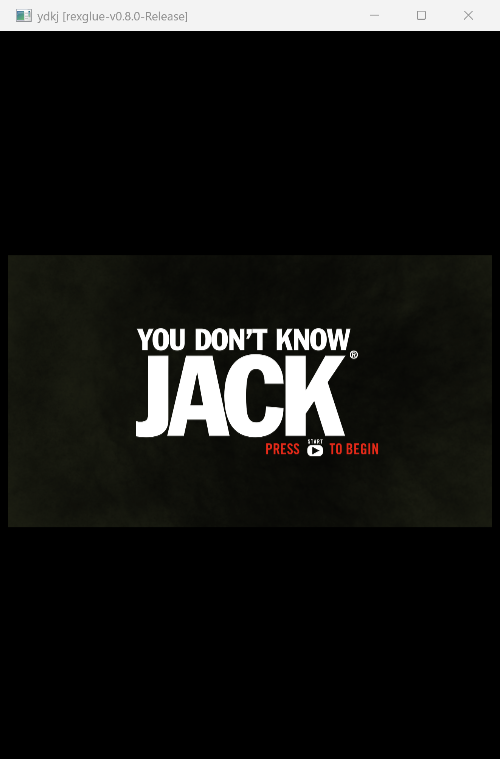

# You Don't Know Jack — native PC recompilation

**Jellyvision's smart-aleck quiz show, statically recompiled from Xbox 360
PowerPC to a native x86-64 executable.** No emulator, no interpreter, no JIT —
the original disc code is translated to C++ with the
[ReXGlue SDK](https://github.com/rexglue/rexglue-sdk) **v0.8.0** and linked
against its runtime. It builds clean, boots crash-free, and **renders its
front-end natively on D3D12** — right up to the "PRESS START TO BEGIN" screen.

## Status: **renders the front-end** 🎩

Extraction → triage → codegen → build → bring-up, all in one sitting. The 5 MB
game executable — **14,781 recompiled functions** — compiles, links into a
21 MB `ydkj.exe` with **zero kernel stubs**, boots crash-free, and draws real
frames: the **THQ publisher splash**, then the **animated "YOU DON'T KNOW JACK"
title screen with fully-rendered text**, waiting on START.



*The title screen — "YOU DON'T KNOW JACK / PRESS ▶ START TO BEGIN" — rendered by
the recompiled game on D3D12 (NVIDIA RTX 5070). The THQ boot splash
(`images/thq_splash.png`) gets you here.* See [PROGRESS.md](PROGRESS.md) for the
full blow-by-blow.

> **Honest scope:** the front-end renders and reaches the interactive title
> screen; **input into an actual question round hasn't been driven yet.** Text
> renders fine (no memexport gap), so the path to gameplay looks clear — that's
> the next step.

## How it got here

The whole pipeline — from a retail disc image to a rendering `.exe` — in one pass:

```
XGD disc image ──▶ XDVDFS extract ──▶ XEX triage ──▶ rexglue init + codegen
  (7.8 GB ISO)      (2,702 files)    (base 0x82000000)  (PowerPC → C++, 14,781 fns)
      │
      └──▶ clang/lld build ──▶ ydkj.exe (21 MB, 0 stubs) ──▶ boot ──▶ D3D12 up
           ──▶ 📼 XEX loaded ──▶ 🅃🅗🅠 splash ──▶ 🎩 title screen (text + START prompt)
```

Codegen and build were minutes of work. The craft was **runtime bring-up**:

- **One codegen hint.** The first pass surfaced a single `UnresolvedCall` — a
  tail-call to `0x82236F38` that discovery hadn't placed in a function. One
  `[entrypoint.functions]` entry, and the second pass came back clean.
- **The link, for free.** All recomp TUs compiled first try, and the v0.8.0
  runtime already exports every one of the game's **209** kernel/XAM imports
  (verified by diffing `__imp__` symbols against the SDK libs) — so it linked
  with **zero** hand-written stubs.
- **The unregistered-function wall, cleared in two moves.** First boot came up
  fully — D3D12 device, XEX loaded, guest code running — then FATAL'd on a call
  to `0x82131FF0`. That's the house-standard bring-up class (functions reached
  only through data pointers or computed addresses, invisible to branch
  discovery). Cleared it: (1) `extract_pe.py` decompressed the image and
  `find_missing_vtable_funcs.py` found **231** vtable/thunk entries → batch
  registered; (2) a tolerant-dispatch harvest run surfaced just **2** more
  `lis/addi`-computed targets → registered those too. **234 hints** total →
  **boots crash-free** and renders.

## Binary facts

| | |
|---|---|
| Title | You Don't Know Jack (2011) — Jellyvision / **THQ**, title ID `0x54510869` (publisher `TQ`) |
| Format | XGD disc image (XDVDFS) — 7.8 GB ISO, 2,702 files extracted |
| Image base | `0x82000000` (standard) |
| Image size | `0x650000` (6.3 MB code image — the disc bulk is FMV + audio question banks) |
| Imports | `xam.xex`, `xboxkrnl.exe` only — **no XNET/Live import wall** |
| Fun fact | the XEX's `ORIGINAL_BASE_ADDRESS` field reads `0x4A61636B` = ASCII **"Jack"** |
| Recompiled functions | **14,781** (234 bring-up hints) |
| Executable | `ydkj.exe`, 21 MB — **0 kernel stubs** |
| Toolchain | ReXGlue **v0.8.0**, Clang 21, Ninja, lld-link |

## Build & run

You **bring your own** copy of the game — the disc image, extracted assets, and
recompiled C++ are all git-ignored. This repo tracks the project, not the game.
Prereqs: Clang 20+, CMake 3.25+, Ninja, and a built ReXGlue SDK v0.8.0.

```bash
# 1. Extract your retail disc image with the 360tools kit
python /path/to/360tools/tools/extract_iso.py "You Dont Know Jack.iso" extracted/

# 2. Regenerate the recompiled C++ (git-ignored, ~59 MB)
cd project && rexglue codegen      # re-applies the 234 [entrypoint.functions] hints

# 3. Build
cmake --preset win-amd64-release "-DCMAKE_PREFIX_PATH=<rexglue-sdk>/out/install/win-amd64"
cmake --build out/build/win-amd64-release

# 4. Run  (mounts the extracted game dir as game:\)
./out/build/win-amd64-release/ydkj.exe --game_data_root=../../extracted
```

## Layout

```
project/
  ydkj_manifest.toml       # codegen config + 234 function-entry hints (the bring-up work)
  CMakeLists.txt           # sources + optional -DYDKJ_HARVEST harvest build
  CMakePresets.json        # clang/ninja presets
  src/main.cpp             # ReXGlue app entry
  src/ydkj_app.h           # app hooks
  src/dispatch_tolerance.cpp # bring-up harvest scaffold (off by default)
  generated/default/       # codegen output — git-ignored, regenerable
images/                     # screenshots captured from the running port
extracted/                  # game data — bring your own (git-ignored)
```

## Credits

Built on the [ReXGlue SDK](https://github.com/rexglue/rexglue-sdk) (recompiler +
runtime, D3D12/Vulkan backends derived from
[Xenia](https://github.com/xenia-project/xenia)) and the
[360tools](https://github.com/sp00nznet/360tools) toolkit. You Don't Know Jack
and all game assets are © Jellyvision / THQ / the respective rights holders —
this project contains **none** of them. Every game recompiled is a game preserved.

## License

This project's own code (the app entry, harvest scaffold, manifest, and scripts)
is [MIT](LICENSE). It does **not** cover the game (bring your own) or the ReXGlue
SDK and its dependencies, which carry their own licenses.
